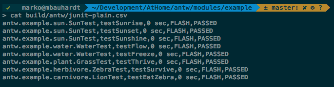




### JunitLogger
This logger log all messages coming from the antw [junit standard formatter](/documentation/junit-formatter/junit-standard-formatter.html) into file *junit_plain.csv*
This is a comma separated value file. Consisting of 6 columns

    TestSuite, TestCase, DurationInSec, TestGroup, Status, TestFailureMessage

The test group are a kind of category based on the duration. It is currently a hardcoded value. There is a [issue](https://github.com/mbauhardt/antw/issues/22) to resolve this.

    FLASH   <   FAST     <   ONE_MIN   <   THREE_MIN   <   SEVEN_MIN   <   UUH
    1 sec   <   10 sec   <   1 min     <   3 min       <   7 min       <   ?

