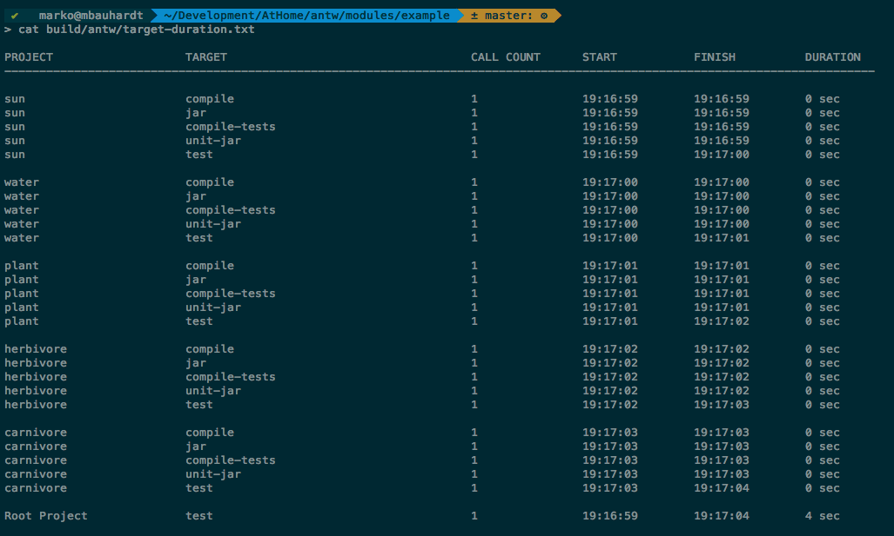
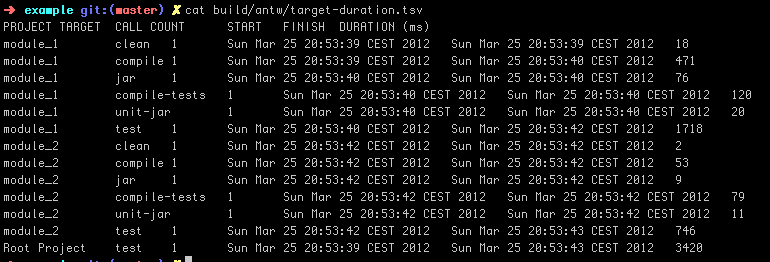




##### DurationLogger
It exists two implementations that log target statistics about your ant build. A DurationLogger is logging a kind of table into a file called *target_duration.txt*. 

The same informations, but only in a form of a csv file is logged into a file called *target_duration.tsv*. This file can be easily import into e.g. a excel based application to analyze these information.

