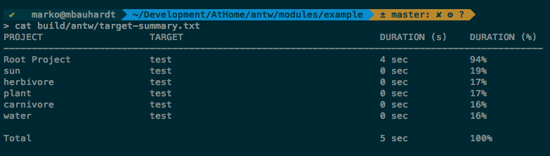




### TargetSummaryLogger
This logger will log a summary about your build into a file called *target-summary.txt*. 
The table contains the project, the regarding target that is executed in this project and a duration in seconds and in percent. 
But you can not sum up all the seconds or the all the percentage of every module to get a 100% coverage. 
The duration of a target is the sum of the duration from all depending targets. 
Targets that are under 5% from the the build will be excluded from this table.

