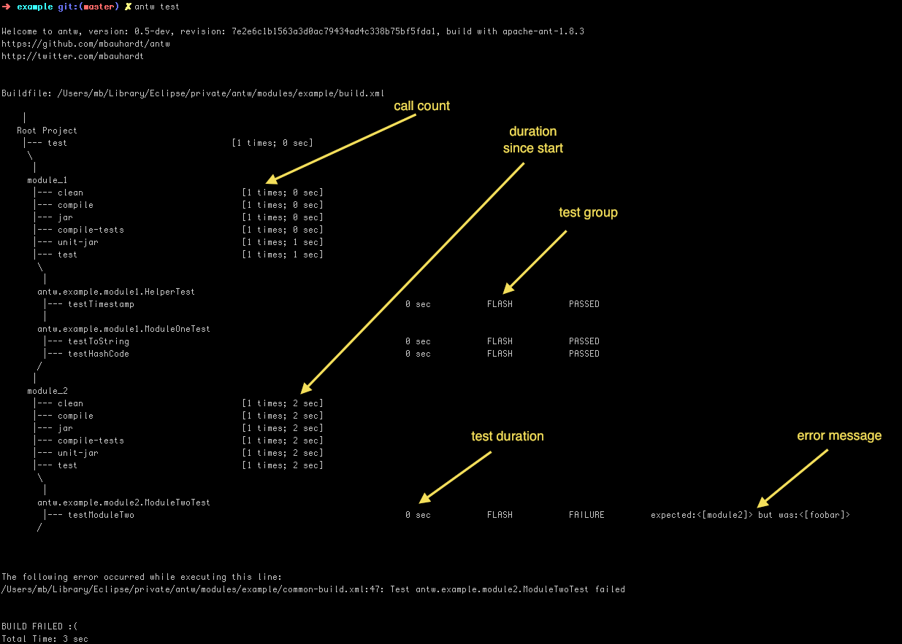




### TreeLogger
This is the default logger. All log messages of the build process goes to standard out. The build is logged as a kind of a tree. The following screenshots shows also junit informations. these informations are logged with the antw junit formatter. see [Optional][]

