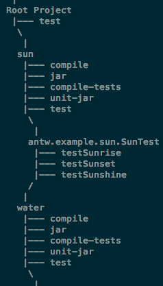



	

		<h3>What Is Antw</h3>
		

			Antw is a wrapper which contains <a href="http://ant.apache.org">apache ant</a> with some nice features.
			The main goal is to have an application which provides an easy installer for <i>apache ant</i> and a better logging to see statistics about your build.
			Antw provides those statistics. All reports are logged into files located in your build directory (usually <b>build/antw</b>).
		

	

	

		<ul class="thumbnails">
		  <li class="span2">
		    
		  </li>
		</ul>
	

&nbsp;

&nbsp;

&nbsp;

	

		<h4>Installer</h4>
		

			The installer will install the latest stable version of <a href="http://ant.apache.org">apache ant</a>. 
			You need no administrator privileges to install antw. 
			Furthermore you have an easy to use updater which updates your antw/apache ant installation.    		
		

	

	
&nbsp;

	
&nbsp;

	

		<h4>Many Build Logger's</h4>
		

			Antw provides many build loggers to log statistics about your ant build. The default logger, which log to standard output, is a kind of tree. 
			It shows only the target names incl. call count and duration. 
			The rest of the build loggers create report files which contains more detailed informations about your ant targets. 		
		

	

	
	

		<h4>Different JUnit Formatter</h4>
		

			Some JUnit formatter's are also included within <i>antw</i> which provides a cleaner format about the running junit tests.
			The formatting of the running tests contains test duration, test groups or profiling information.
		

	

	

		<h4>Lightweight Profiler</h4>
		

			A very cool feature is the lightweight profiler. The profiler profiles the running junit tests.
			Creates a snapshot about the current method stack trace for every thread and provide a call count and duration about each method in this stack.
		
	
	

