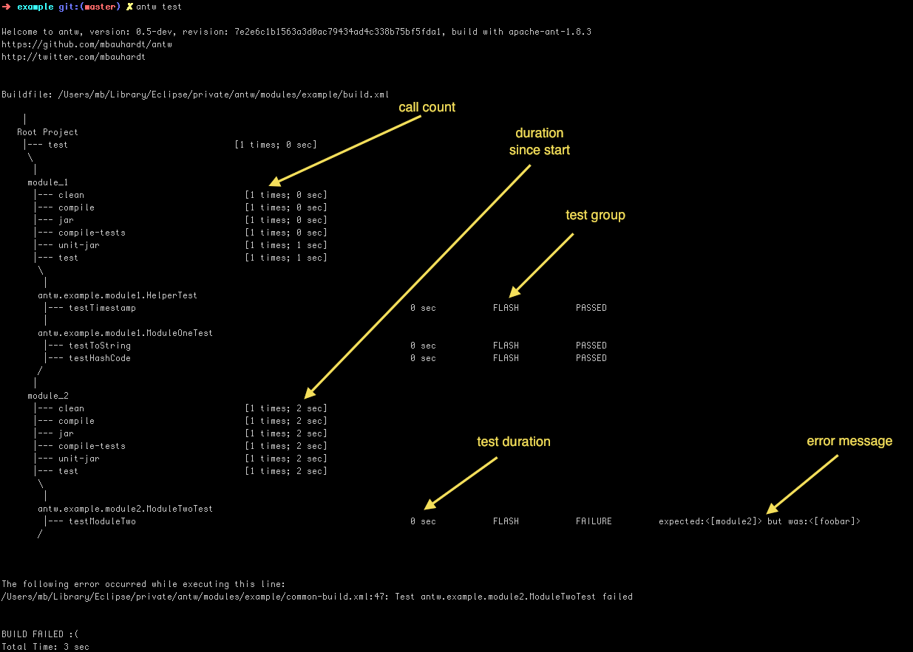
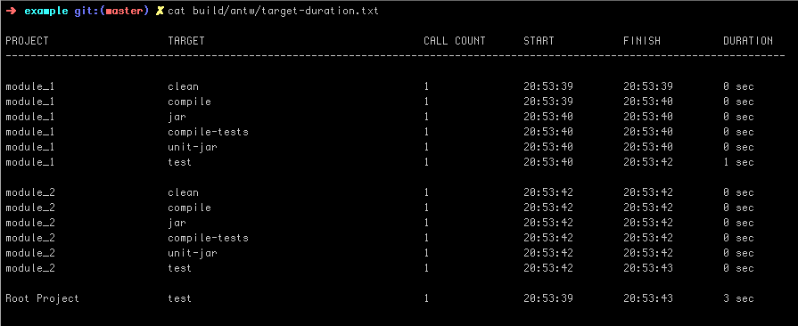
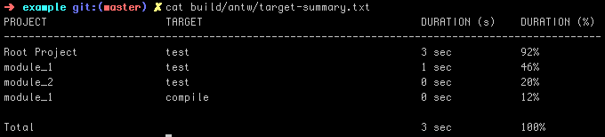
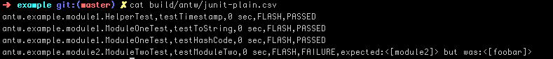
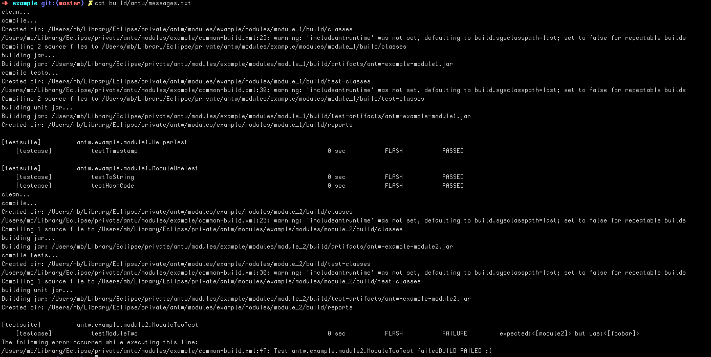
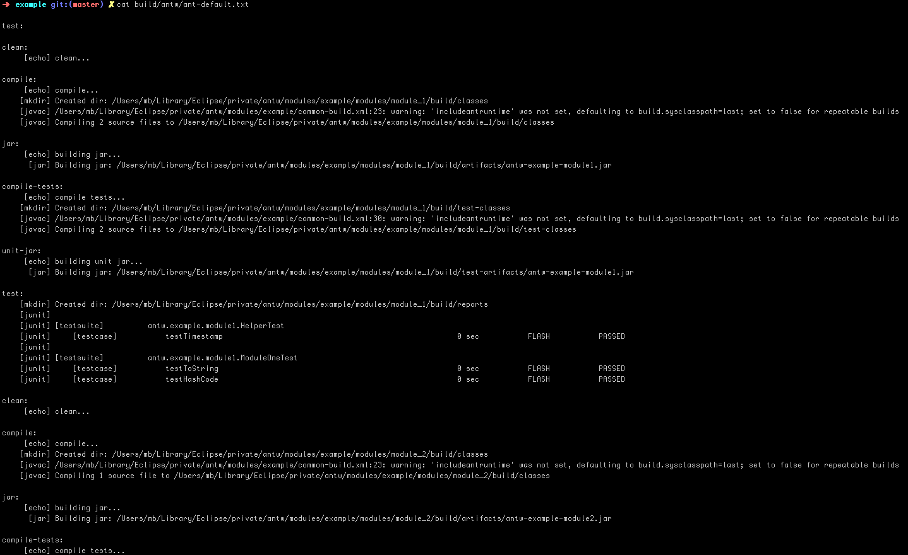

---
title:	antw version 0.5
---
<link href="http://kevinburke.bitbucket.org/markdowncss/markdown.css" rel="stylesheet"></link>

---

# Antw
a wrapper for apache ant

---

Table Of Content

1. [About][]
2. [Installation][]
3. [Desinstallation][]
4. [Usage][]
5. [Logger And Formatter][]
    * [TreeLogger][]
    * [DurationLogger][]
    * [TargetSummaryLogger][]
    * [JunitLogger][]
    * [MessageLogger][]
    * [AntDefaultLogger][]

---

### About
Antw is a wrapper for apache ant. Antw attach at runtime a bunch of loggers to log some helpful statistics about your build. All statistics are logged to a directory called *antw* located in your build directory (usually *build/antw*).

### What antw will do for you
Antw will download and install apache ant version 1.8.3 for you under directory
    
    ~/.antw/install/contrib

It provides a script that use a set of loggers. All loggers log interesting statistics about your build. Not more.

---

### Installation
You can install *antw* via *curl* or *wget*  

via curl

    curl -L https://raw.github.com/mbauhardt/antw/latest/src/main/scripts/antw-checkout.sh | sh

or via wget

    wget --no-check-certificate https://raw.github.com/mbauhardt/antw/latest/src/main/scripts/antw-checkout.sh -O - | sh

This will install the *antw* sources under directory

    ~/.antw/source

And the binary under directory

    ~/.antw/install

After installation add the bin folder to your PATH

    export PATH=$PATH:~/.antw/install/bin

### Desinstallation
Remove the directory *.antw*

    rm -rf ~/.antw

---

### Usage
The recommended way to use *antw* is to download/install the whole antw project, see above. 
There are two commands to use *antw*.

    antw - executes apache ant with some special loggers
    antw-update - update your antw installation

##### Optional
It is also recommended but optional to enable the antw junit formatter in your ant project when you use  *antw*. Goto the download page

    https://github.com/mbauhardt/antw/downloads

and download the *antw-common.jar* and the *antw-junit.jar* and add these jar files to your classpath. After that enable the formatter

    <formatter classname="antw.junit.JUnitFormatter" usefile="false"/>

##### Note
When you want to try the antw loggers without to install *antw* you can try to integrate the loggers manually to your ant build.
Download the *antw-common.jar* and the *antw-logger.jar* and add these jar files to the cmd line when execute ant.

    ant -lib antw-common-0.5.jar:antw-logger-0.5.jar -logger antw.logger.AntwLogger $@

You should see the same logging like when you use the antw app itself. But strongly recommended is to install the whole app.

---

### Logger and Formatter
The following loggers will attach at runtime to the ant process. We will demonstrate the different loggers with a small ant multiproject build that has two separately modules.

    project
        build.xml
        modules
            module_1
                build.xml
            module_2
                build.xml

This project has a *target* test that depends on compile, compile-test, jar, unit-jar etc. There are two tests in *module_1*  they are passed. There are one test in *module_2* that will fail.

##### TreeLogger
This is the default logger. All log messages of the build process goes to standard out. The build is logged as a kind of a tree. The following screenshots shows also junit informations. these informations are logged with the antw junit formatter. see [Optional][]

##### DurationLogger
It exists two implementations that log target statistics about your ant build. A DurationLogger is logging a kind of table into a file called *target_duration.txt*. 

The same informations, but only in a form of a csv file is logged into a file called *target_duration.tsv*. This file can be easily import into e.g. a excel based application to analyze these information.

##### TargetSummaryLogger
This logger will log a summary about your build into a file called *target-summary.txt*. The table that is logged shows the project, the regarding target that is executed in this project and a duration in seconds and in percent. But you can not sum up all the seconds or the all the percentage of every module to get a 100% coverage. When a target depends on few other targets, then this target has a duration of the sum of all depending targets. Targets that are under 5% of the duration from the build will be excluded.

##### JunitLogger
This logger log all tests (that is shown in the tree view as well) into a file called *junit_plain.csv*. This is a comma separated value file. Consisting of 6 columns

    TestSuite, TestCase, DurationInSec, TestGroup, Status, TestFailureMessage

The test group are a kind of category based on the duration. It is currently a hardcoded value.

    FLASH	<	FAST	<	ONE_MIN		<	THREE_MIN	<	SEVEN_MIN	<	UUH
    1 sec	<	10 sec	<	1 min		<	3 min		< 	7 min		<	?

##### MessageLogger
The MessageLogger will log all messages filtered by the log level to file *messages.txt*

##### AntDefaultLogger
The file *ant-default.txt* contains the messages from the ant default logger.

