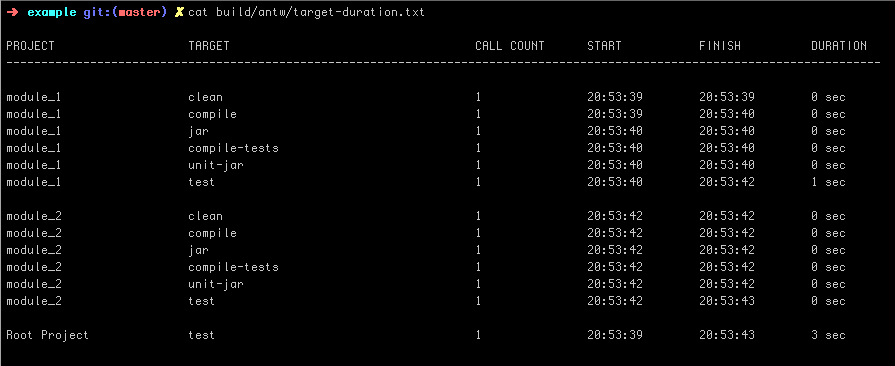
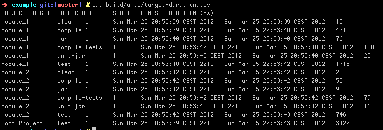
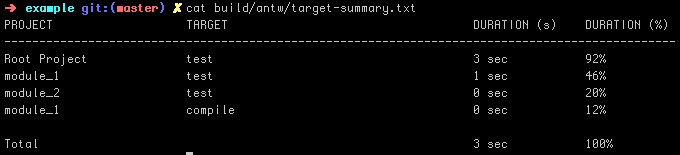

---
title:	antw version 0.5
---
<link href="http://kevinburke.bitbucket.org/markdowncss/markdown.css" rel="stylesheet"></link>

---

# Antw
a wrapper for apache ant

### About
Antw is a wrapper for apache ant. Antw attach at runtime a bunch of loggers to log some helpful statistics about your build. All statistics are logged to a directory called *antw* located in your build directory (usually *build/antw*).

### What antw will do for you
Antw will download and install apache ant version 1.8.3 for you under directory
    
    ~/.antw/install/contrib

It provides a script that use a set of loggers. Not more.

---

### Installation
You can install *antw* via *curl* or *wget*  

via curl

    curl -L https://raw.github.com/mbauhardt/antw/latest/src/main/scripts/antw-checkout.sh | sh

or via wget

    wget --no-check-certificate https://raw.github.com/mbauhardt/antw/latest/src/main/scripts/antw-checkout.sh -O - | sh

This will install the *antw* sources under directory

    ~/.antw/source

And the binary under directory

    ~/.antw/install

After installation add the bin folder to your PATH

    export PATH=$PATH:~/.antw/install/bin

### Desinstallation
Remove the directory *.antw*

    rm -rf ~/.antw

### Usage
There are two commands to use *antw*.

    antw - executes apache ant with some special loggers
    antw-update - update your antw installation

---

### Logger and Formatter
The following loggers will attach at runtime to the ant process. We will demonstrate the different loggers with a small ant multiproject build that has a root project with a core module and two separately modules.

    project
        build.xml
        core
            build.xml
        modules
            module_1
                build.xml
            module_2
                build.xml

This project has a *target* jar that depends on compile and that depends on clean.

##### TreeLogger
This is the default logger. All log messages of the build process goes to standard out. The build is logged as a kind of a tree.

##### DurationLogger
It exists two implementations that log target statistics about your ant build. A DurationLogger is logging a kind of table into a file called *target_duration.txt*. 

The same informations, but only in a form of a csv file is logged into a file called *target_duration.tsv*. This file can be easily import into e.g. a excel based application to analyze these information.

##### TargetSummaryLogger
This logger will log a summary about your build into a file called *target-summary.txt*. The table that is logged shows the project, the regarding target that is executed in this project and a duration in seconds and in percent. But you can not sum up all the seconds or the all the percentage of every module to get a 100% coverage. When a target depends on few other targets, then this target has a duration of the sum of all depending targets.

