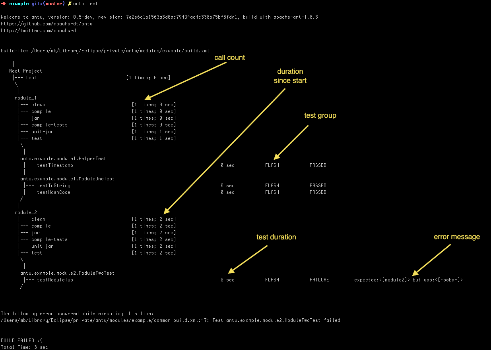

# Antw
a wrapper for apache ant

## About
Antw is a wrapper for apache ant. Antw attach at runtime a bunch of loggers to log some helpful statistics about your build.

## What will antw do for you
Antw will download and install apache ant version 1.8.3 for you under directory
    
    ~/.antw/install/contrib

It provides a script that use a set of loggers. Not more.

## Installation
You can install *antw* via *curl* or *wget*  

via curl

    curl -L https://raw.github.com/mbauhardt/antw/latest/src/main/scripts/antw-checkout.sh | sh

or via wget

    wget --no-check-certificate https://raw.github.com/mbauhardt/antw/latest/src/main/scripts/antw-checkout.sh -O - | sh

This will install the *antw* sources under directory

    ~/.antw/source

And the binary under directory

    ~/.antw/install

After installation add the bin folder to your PATH

    export PATH=$PATH:~/.antw/install/bin

## Desinstallation
Remove the directory *.antw*

    rm -rf ~/.antw

## Usage
There are two commands to use *antw*.

    antw - executes apache ant with some special loggers
    antw-update - update your antw installation

## Logger and Formatter
The following loggers will attach at runtime to the ant process. We will demonstrate the different loggers with a small ant multiproject build that has a root project with a core module and two separately modules.

    project
        build.xml
        core
            build.xml
        modules
            module_1
                build.xml
            module_2
                build.xml

This project has a *target* jar that depends on compile and that depends on clean.

### TreeLogger
This logger log the build process on standard out. The build is logged as a kind of a tree.

### DurationLogger

